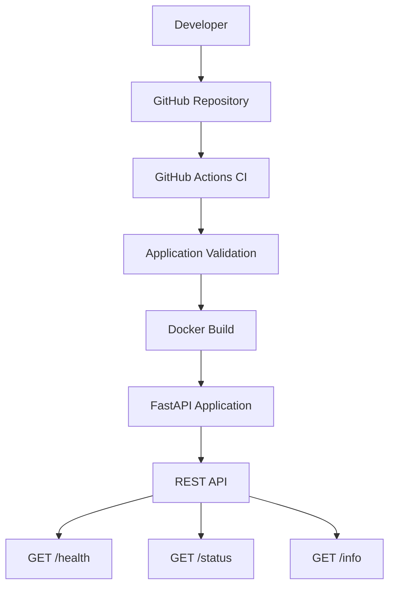

# DevSecOps Automation Pipeline

Projeto desenvolvido para demonstrar a automação e a padronização de uma pipeline de Integração Contínua (CI), aplicando conceitos e práticas de DevSecOps em uma aplicação desenvolvida com FastAPI e containerizada com Docker.

A solução utiliza GitHub Actions para automatizar a validação da aplicação e foi criada como um laboratório prático para evolução contínua em automação, infraestrutura moderna e engenharia de software.

O projeto teve origem como Trabalho de Conclusão do MBA em Engenharia de Software da Universidade de São Paulo (USP) e continua em desenvolvimento.


## Informações do Projeto

| Item | Descrição |
|------|-----------|
| **Objetivo** | Demonstrar a automação de uma pipeline de Integração Contínua utilizando práticas de DevSecOps |
| **Linguagem** | Python |
| **Framework** | FastAPI |
| **Containerização** | Docker |
| **Integração Contínua** | GitHub Actions |
| **Status** | Em desenvolvimento |
| **Instituição** | Universidade de São Paulo (USP) |


## Sumário

- [Visão Geral](#visão-geral)
- [Objetivos](#objetivos)
- [Arquitetura](#arquitetura)
- [Tecnologias](#tecnologias)
- [Funcionalidades](#funcionalidades)
- [Estrutura do Repositório](#estrutura-do-repositório)
- [Primeiros Passos](#primeiros-passos)
- [Documentação da API](#documentação-da-api)
- [Pipeline de Integração Contínua](#pipeline-de-integração-contínua)
- [Docker](#docker)
- [Roadmap](#roadmap)
- [Sobre o Projeto](#sobre-o-projeto)
- [Autor](#autor)
- [Licença](#licença)


## Visão Geral

O projeto tem como objetivo demonstrar a implementação de uma pipeline automatizada para validação e entrega de aplicações, utilizando ferramentas amplamente empregadas em ambientes corporativos.

A proposta é disponibilizar uma estrutura simples, organizada e reproduzível, permitindo a evolução gradual da solução com novas funcionalidades relacionadas à integração contínua, segurança, infraestrutura como código e observabilidade.

Além de atender aos requisitos acadêmicos do trabalho de conclusão de curso, o projeto também serve como portfólio técnico para aplicação prática de conceitos utilizados em ambientes DevOps.


## Objetivos

Os principais objetivos deste projeto são:

- Demonstrar a criação de uma API utilizando FastAPI.
- Containerizar a aplicação utilizando Docker.
- Automatizar a validação da aplicação utilizando GitHub Actions.
- Padronizar o processo de integração contínua.
- Aplicar conceitos fundamentais de DevSecOps em uma aplicação real.
- Disponibilizar uma base para futuras implementações envolvendo segurança, infraestrutura como código e monitoramento.
- Consolidar conhecimentos adquiridos durante o MBA em Engenharia de Software da USP.


## Arquitetura

A arquitetura foi projetada para demonstrar uma pipeline de Integração Contínua (CI) simples, modular e reproduzível, utilizando ferramentas amplamente empregadas em ambientes corporativos.

Atualmente, a solução é composta pelos seguintes componentes:

- API REST desenvolvida com FastAPI;
- Containerização da aplicação utilizando Docker;
- Pipeline automatizada utilizando GitHub Actions;
- Repositório GitHub para versionamento do código.

Essa estrutura estabelece uma base sólida para futuras implementações envolvendo análise automatizada de vulnerabilidades, Infraestrutura como Código (IaC), observabilidade e implantação em ambientes Cloud.


### Diagrama de Arquitetura




### Pipeline de Integração Contínua

A aplicação utiliza uma pipeline de Integração Contínua (CI) para automatizar a validação do projeto sempre que alterações são enviadas ao repositório.

Fluxo atual:

- inicialização automática após um **push** ou **pull request**;
- preparação do ambiente de execução;
- instalação das dependências;
- validação da aplicação;
- conclusão da execução da pipeline.

Essa automação reduz atividades manuais, aumenta a confiabilidade do processo de desenvolvimento e estabelece uma base para futuras implementações relacionadas à Entrega Contínua (CD) e às práticas de DevSecOps.


## Tecnologias

O projeto foi desenvolvido utilizando tecnologias amplamente adotadas em ambientes modernos de desenvolvimento, infraestrutura e automação.

| Tecnologia | Finalidade |
|------------|------------|
| Python | Linguagem utilizada no desenvolvimento da aplicação |
| FastAPI | Framework para construção da API REST |
| Docker | Containerização da aplicação |
| GitHub Actions | Automação da pipeline de Integração Contínua (CI) |
| Git | Controle de versão do projeto |


## Funcionalidades

Atualmente o projeto disponibiliza as seguintes funcionalidades:

- Desenvolvimento de uma API REST utilizando FastAPI;
- Containerização da aplicação com Docker;
- Pipeline automatizada de Integração Contínua (CI) utilizando GitHub Actions;
- Validação automática da aplicação durante o processo de integração;
- Endpoints para monitoramento e verificação da aplicação;
- Estrutura preparada para evolução contínua da solução.

As funcionalidades previstas para as próximas etapas estão descritas na seção **Roadmap**.


## Estrutura do Repositório

A organização do projeto foi definida para facilitar sua manutenção e evolução.

```text
tcc-devops-pipeline
│
├── .github/
│   └── workflows/
│       └── ci.yml
│
├── app/
│   └── main.py
│
├── docs/
│   ├── evidencias/
│   ├── referencias/
│   └── resultados-preliminares.md
│
├── Dockerfile
├── requirements.txt
├── README.md
├── .gitignore
└── .dockerignore
```

### Estrutura do Diretório

| Diretório | Descrição |
|------------|-----------|
| `.github/workflows` | Pipeline de Integração Contínua |
| `app` | Código-fonte da aplicação |
| `docs` | Documentação técnica e evidências |
| `Dockerfile` | Definição da imagem Docker |
| `requirements.txt` | Dependências da aplicação |
| `README.md` | Documentação principal |


## Primeiros Passos

As instruções abaixo descrevem como configurar e executar o projeto em um ambiente local.


### Prerequisitos

Antes de iniciar, certifique-se de possuir os seguintes softwares instalados:

| Software | Versão recomendada |
|-----------|-------------------|
| Git | 2.x ou superior |
| Python | 3.13 ou superior |
| Docker Desktop | versão mais recente |
| Visual Studio Code (opcional) | versão mais recente |


### Clonar o repositório

Clone o repositório utilizando o comando abaixo:

```bash
git clone https://github.com/gui6j/tcc-devops-pipeline.git
```
Acesse o diretório do projeto:

```bash
cd tcc-devops-pipeline
```

### Executar com Docker

Construa a imagem Docker:

```bash
docker build -t devsecops-pipeline .
```

Execute o container:

```bash
docker run -d -p 8000:8000 --name devsecops-pipeline devsecops-pipeline
```

Verifique se o container está em execução:

```bash
docker ps
```

### Executar localmente

Instale as dependências:

```bash
pip install -r requirements.txt
```

Execute a aplicação:

```bash
uvicorn app.main:app --reload
```


### Verificando a Aplicação

Após iniciar a aplicação, acesse:

| Recurso | URL |
|-----------|-------------------|
| API | http://localhost:8000 |
| Swagger UI | http://localhost:8000/docs |
| Health Check | http://localhost:8000/health |


## Documentação da API

A aplicação disponibiliza uma API REST desenvolvida com FastAPI para validação da aplicação e monitoramento de seu estado de execução.

Após iniciar a aplicação, a documentação interativa poderá ser acessada através do Swagger UI.

| Recurso | URL |
|----------|-----|
| Swagger UI | http://localhost:8000/docs |
| OpenAPI JSON | http://localhost:8000/openapi.json |


### Endpoints Disponíveis

| Método | Endpoint | Descrição |
|---------|----------|-----------|
| GET | `/` | Retorna a mensagem inicial da aplicação. |
| GET | `/health` | Verifica se a aplicação está operacional. |
| GET | `/status` | Retorna informações sobre o estado da aplicação. |
| GET | `/info` | Exibe informações gerais da aplicação. |
| GET | `/versao` | Retorna a versão atual da aplicação. |
| GET | `/metricas` | Disponibiliza métricas básicas da aplicação para futuras integrações com ferramentas de monitoramento. |


### Resposta de Exemplo

### GET /health

```json
{
    "status": "UP"
}
```


### Interface de Documentação da API

A FastAPI gera automaticamente uma documentação interativa baseada na especificação OpenAPI.

Após executar a aplicação, basta acessar:

```text
http://localhost:8000/docs
```

A interface permite:

- visualizar todos os endpoints disponíveis;
- testar requisições diretamente pelo navegador;
- consultar parâmetros e respostas;
- validar rapidamente o funcionamento da API durante o desenvolvimento.


## Pipeline de Integração Contínua

O projeto utiliza uma pipeline de Integração Contínua (CI) implementada com GitHub Actions para automatizar a validação da aplicação sempre que alterações são enviadas ao repositório.

O fluxo atual da pipeline contempla:

- Inicialização automática após um `push` ou `pull request`;
- Configuração do ambiente de execução;
- Instalação das dependências do projeto;
- Validação da aplicação;
- Finalização da execução da pipeline.

Essa automação garante maior confiabilidade durante o desenvolvimento e estabelece uma base para futuras evoluções relacionadas à entrega contínua (CD) e práticas de DevSecOps.


### Workflow do GitHub Actions

> *Imagem da execução da pipeline.*


## Docker

A aplicação foi containerizada utilizando Docker, permitindo que sua execução ocorra de forma padronizada em diferentes ambientes, reduzindo diferenças entre desenvolvimento e execução.

A imagem Docker é construída a partir do `Dockerfile` disponível na raiz do projeto.

Após a construção da imagem, a aplicação pode ser executada em um container utilizando os comandos apresentados anteriormente na seção **Getting Started**.


### Container em execução

> *Container da aplicação em execução.*


### Documentação da Aplicação

A FastAPI disponibiliza automaticamente uma interface Swagger para documentação e testes da API.

Essa interface permite validar rapidamente os endpoints implementados durante o desenvolvimento.


### Interface do Swagger UI

> *Interface interativa gerada automaticamente pela FastAPI.*


## Roadmap

O projeto continuará evoluindo como laboratório prático para aplicação de conceitos relacionados à automação, DevSecOps e Infraestrutura como Código.

### Próximas Implementações

### Pipeline

- [ ] Expansão da pipeline para práticas de Continuous Delivery (CD).
- [ ] Inclusão de novas etapas automatizadas de validação.
- [ ] Evolução para uma pipeline DevSecOps completa.

### Segurança

- [ ] Integração com Trivy para análise automática de vulnerabilidades.
- [ ] Geração de relatórios de segurança durante a pipeline.
- [ ] Validação de dependências da aplicação.

### Containers

- [ ] Publicação automática de imagens Docker.
- [ ] Otimização da imagem utilizando multi-stage build.

### Infraestrutura

- [ ] Provisionamento de infraestrutura utilizando Terraform.
- [ ] Gerenciamento de configurações com Ansible.
- [ ] Estudos de implantação em ambiente AWS.

### Observabilidade

- [ ] Exposição de métricas no padrão Prometheus.
- [ ] Integração com Grafana para criação de dashboards.
- [ ] Monitoramento da disponibilidade da aplicação.


## Sobre o Projeto

Este projeto teve origem como Trabalho de Conclusão do MBA em Engenharia de Software da Universidade de São Paulo (USP) e continua evoluindo como um laboratório prático para estudos de automação, DevSecOps e infraestrutura moderna.

Além de atender aos objetivos acadêmicos, o repositório foi estruturado para aplicar boas práticas de engenharia de software, documentação técnica e automação, servindo também como portfólio para demonstrar conhecimentos adquiridos durante o MBA e estudos complementares.

A proposta é expandir continuamente a solução com novas tecnologias relacionadas à Infraestrutura como Código, Cloud Computing, segurança e observabilidade.


## Autor

**Guilherme Soares**

Analista de Infraestrutura com mais de 14 anos de experiência em ambientes corporativos, atuando com administração de servidores Windows e Linux, Virtualização, Redes, Banco de Dados SQL Server, Active Directory, Automação e Sustentação de Ambientes Críticos.

Atualmente cursando MBA em Engenharia de Software pela Universidade de São Paulo (USP) aplicando práticas modernas de automação, CI/CD e observabilidade ao meu dia a dia em infraestrutura, unindo a solidez da experiência em ambientes corporativos com ferramentas atuais de mercado.

- LinkedIn: https://linkedin.com/in/guilhermesantos-ti
- GitHub: https://github.com/gui6j

### Áreas de Interesse

- DevOps
- Cloud Computing
- Platform Engineering
- Automação de Infraestrutura
- Infraestrutura Microsoft e Linux


## Licença

Este projeto possui finalidade Acadêmica e Educacional.

Sua utilização para fins de estudo é livre, respeitando a autoria e a referência ao projeto original.
